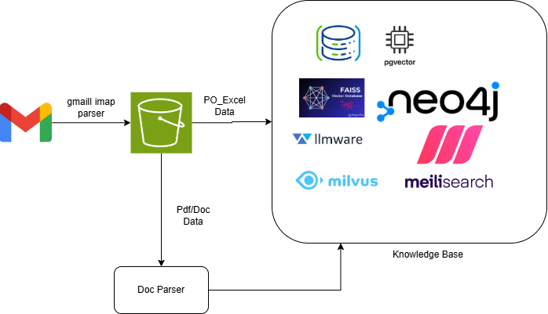

### Deploy to Secured User Access 
1. Kalika Sales Dashboard visualization
2. Kalika Dify Agent 
3, Kalika Sales and Marketing agent 

4. Prompt Workflow
5. AWS Services 
6. GoogleCloud and Agentspace

### RAG

#### Basic RAG Architecture
 -png-2.png?width=2056&height=1334&name=rag-query-drawio%20(1)-png-2.png)

## RAG Usecases

### Gmail RAG

##### 1.Data Extraction:  Extract the PO order and proforma invoice with attached file by searching keyword to S3
 [starting point](https://medium.com/@masego_m/accessing-gmail-with-python-a-beginners-guide-812e0068a568)

#### Problem Statement : Build RAG on Kalika Enterprises Gmail Data

Proforma Invoice Chat Assistant

This project is a Proforma Invoice Chat Assistant powered by Retrieval-Augmented Generation (RAG) and Gemini Pro. It allows users to query information about proforma invoices, retrieve relevant data, and store responses in a PostgreSQL database. Below is an overview of the key functionalities with corresponding screenshots.

Features Overview

Login Functionality

The application features a secure login page where users can access the chat assistant by entering their credentials. This ensures that only authorized users can interact with the system.

RAG User Interface (UI)

After logging in, users access the main interface of the Proforma Invoice Chat Assistant. The UI is designed for ease of use, allowing users to type questions about proforma invoices and receive responses. It displays the app's title and a brief description, highlighting that it is powered by RAG and Gemini Pro.

Response Generation

The chat assistant processes user queries using RAG to generate accurate responses. For example, when a user requests the "top 5 products according to price high to low," the assistant retrieves, ranks, and presents the products with their descriptions and pricing details.

Database Storage

All responses generated by the chat assistant are stored in a PostgreSQL database for future reference. The database table logs the query, response, and metadata like timestamps, ensuring a comprehensive history of interactions.

#### Tasks

1) Understand the details of various documents
    i) Proforma Invoice:A proforma invoice is a preliminary bill that a seller sends to a buyer before a sale is confirmed. It's a non-binding document that's used for planning, budgeting, and estimates. It's also used for customs clearance and financing
    ii) PO Dump : Pending and Processed data details
2) Create the Parsing process
    1) Proforma Invoice
        - Searching a with proforma invoice for smtp mail python utility download attached file
        - Dump that on scheduling daily to s3
        - Extract the content using ocr engine and validate
            try:
            1) [Python package](https://pypi.org/project/invoice2data/)
            2) [Medium article](https://medium.com/@cherylinpz/simplifying-invoice-processing-extracting-tables-with-python-part1-95437f404efb)

   2)  PO dump
       _ On Daily basis Dump is in mail extract excel store in s3
       - Implement pg vector

   ## TODO
       1) Create PG vector on local
       2) Upload po_dump excel in PG vector and create a vector
       3) Test with Ollama local model and create a streamlit app
       4) Test for last 10 days documents with query and response
       5) Generate the report and share it with in team group and github

  3) Deploy on Ec2 for further building POC

## Financial Assistant RAG : B2C

   ### Problem Statement : Uploading Bank statement, Trading Documents(Last trading transaction,orders session details)
   give query response bot.

   1) User can upload documents such as bank statement, trading sheets with Upload button- UI
   2) create PG vector to store
   3) Ollama testing with local model

   ###### Sample Datasets
   [Kaggle](https://www.kaggle.com/datasets/abutalhadmaniyar/bank-statements-dataset?resource=download)

   ###### Link to Refer
   [medium](https://medium.com/@ajaytshaju/converting-bank-statements-to-insights-using-google-sheets-for-data-transformation-and-cleanup-58259d102108)

   ###### Limitation : Data privacy

   Solution: Give a isolated space

   ###### Points of discussion
   1) Explore the techniques for giving data privacy to user

## Various Vector Database

Here are some notable open-source frameworks and libraries for building Retrieval Augmented Generation (RAG) systems:

1. [SWIRL](https://github.com/swirlai/swirl-search): An infrastructure software that facilitates secure and fast searches across data sources without the need for data movement. It integrates with over 20 large language models (LLMs) and is designed for secure deployment within private clouds.

2. Cognita: A modular framework that organizes RAG components for easier testing and deployment. It supports various document retrievers and is fully API-driven, making it suitable for scalable RAG systems.

3. LLM-Ware: This framework focuses on enterprise-ready RAG pipelines, allowing the integration of small, specialized models. It supports a modular architecture and can operate without a GPU.

4. RAG Flow: An engine that emphasizes deep document understanding, enabling effective integration of structured and unstructured data for citation-grounded question-answering.

5. Graph RAG: A graph-based system that enhances LLM outputs by incorporating structured knowledge graphs, making it ideal for complex enterprise applications.

6. Haystack: An orchestration framework that connects models, vector databases, and file converters to create advanced RAG systems, supporting customizable pipelines for various tasks.

7. Storm: A knowledge curation system that generates comprehensive reports with citations, integrating advanced retrieval methods to support multi-perspective question-asking.
